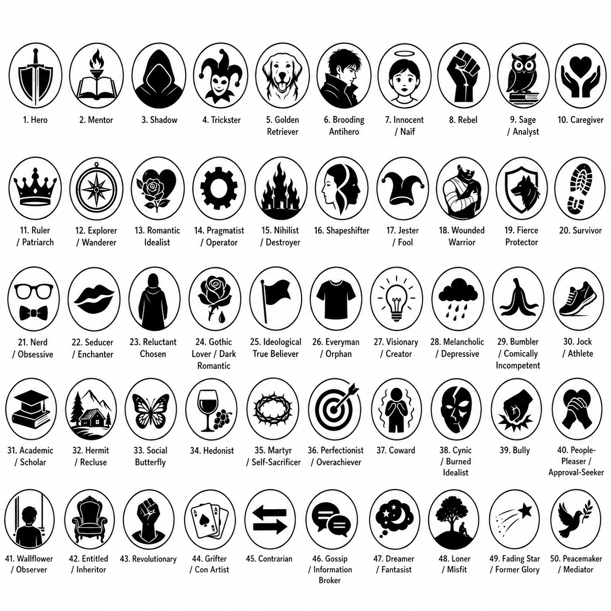
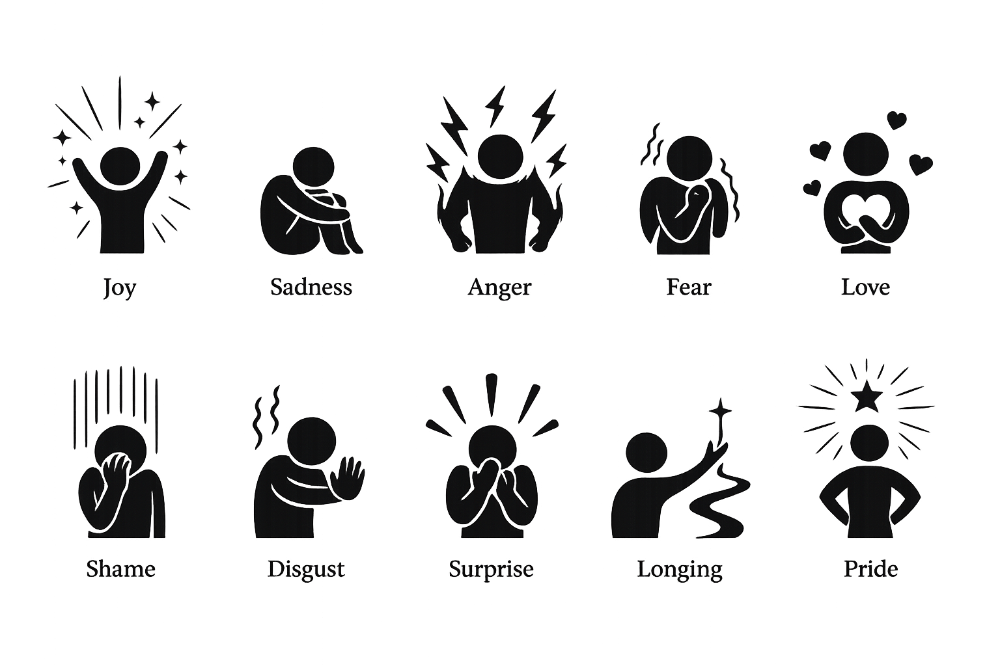

<div align="center">
  
  <p><em>An AI reading companion for fiction manuscripts</em></p>
</div>

---

Mirror is a desktop tool that uses Claude to read fiction manuscripts the way a thoughtful editor would — tracking characters, charting emotional arcs, mapping genre signals, and catching copy errors, all from a single `.docx` file.

Six independent analyses. Results cached locally. PDF reports for every pane.

---

## Analyses

### Opening
First impressions from the opening ~1 500 words, structured as an editor's quick notes.

| Checklist item | What it captures |
|---|---|
| **Hook** | Whether the opening line or scene creates immediate pull |
| **Plot promise** | What kind of story is being set up |
| **Conflict type** | Internal / external / interpersonal / societal |
| **Genre promise** | The genre signals the opening sends |
| **Tone / style promise** | Register, voice, pacing |
| **Protagonist** | Who we're following and what kind of person they seem to be |
| **Time and place** | How clearly the world is established |
| **Ending** | Whether an ending is foreshadowed |
| **Target group** | Broad audience category, then a more specific niche |

Each item is marked with a confidence level: 🤗 came through clearly · 😐 possible but uncertain · 😕 no real signal.

---

### Plot
Three-pass pipeline that reads the whole manuscript and builds a navigable story map.

**Pass 1 — Beat notes.** Each large chunk (~24 000 chars) is summarised into 3–5 concrete bullet points: characters, key events, emotional register.

**Pass 2 — Synthesis.** A single call over all beat notes produces a one-sentence logline and a full-arc synopsis paragraph.

**Pass 3 — Beat labelling.** Each beat note is matched to a story-craft term (inciting incident, midpoint, dark night of the soul, climax, etc.) with a one-sentence summary and a 2–4 sentence expansion. Long manuscripts are split across multiple calls to avoid output truncation.

**Arc cards.** After the beat labels, two further calls identify structural arcs (three-act, hero's journey, in medias res, frame narrative, etc.) and per-character arcs — each with a start-state and end-state phrase.

---

### Archetypes

Three-pass character archetype analysis across 50 archetypes.

<div align="center">
  
</div>

**Pass 1 — Character discovery.** Identifies every character with meaningful page presence, ranked by centrality across the full manuscript. Skipped when Focal Characters are supplied.

**Pass 2 — Signal annotation.** For each character moment the model first describes the behaviour in its own words, then scores all enabled archetypes (0–10, recording only ≥ 3). This behaviour-first step catches quiet and ambiguous moments, not just dramatic ones.

**Pass 3 — Negative annotation.** Hunts for moments where each character contradicts or subverts their top-3 archetypes (minimum violation score 4). Stored as negative-valued points in the same time-series.

Results include:
- **Character cards** with bar chart of top archetypes, archetype icons sized proportionally to score, and a synopsis
- **Time-series plot** — smoothed curves showing each character's top-3 archetype scores across the manuscript; dots are clickable to reveal the underlying signal quote
- **PDF report** with all of the above

<div align="center">
  
</div>

---

### Emotions

Two-pass pipeline scoring 10 emotions per character across the full manuscript.

<div align="center">
  
</div>

**Pass 1 — Character discovery.** Shared with Archetypes when both are run; otherwise runs its own discovery pass.

**Pass 2 — Emotion annotation.** For each character moment: describes what the character feels or how they express (or hide) the emotion, then scores all enabled emotions (0–10). Quiet moments — holding back tears, forcing a smile, going very still — count as much as open weeping or rage.

Results include:
- **Spider plot** (polar chart, Plutchik-arranged: Joy ↔ Sadness, Anger ↔ Fear, Trust ↔ Disgust) showing each character's dominant emotion profile, with emotion icons sized proportionally to score
- **Time-series plot** with weighted smoothing (0.5 self + 0.1 prev + 0.1 next + 0.3 chunk valence)
- **PDF report**

---

### Genres

Single-pass annotation across 20 genre definitions with representative tropes.

Each text chunk (~3 500 chars) is scored for genre signals. The model must quote evidence directly from the excerpt; off-excerpt knowledge is suppressed. Signals with ≥ 55% token overlap are deduplicated across chunks.

Results include a time-series plot showing signal density per genre over narrative progress, with clickable dots revealing the trope name and quote. All 20 genres are individually selectable.

---

### Copyedit

Flags mechanical, style, and craft issues inline. Every flag is inserted as a Word review comment in a saved copy of the source document, anchored to the exact text span.

**20+ error categories** across three tiers:

*Mechanical* — spelling, punctuation, whitespace, em dash, grammar, hyphenation, number formatting, inconsistent naming

*Style* — repetition, cuttable modifiers, redundant *that*, weak verbs, wordy phrases, vague words, repetitive syntax

*Craft* — unusual words, filter words, throat-clearing, passive voice, telling emotion

House style (quotation marks, ellipsis style, em dash spacing, Oxford comma, American/British spelling) is configurable per project in `config/style_config.json`.

---

## Setup

### 1. Install dependencies

```bash
pip install -r requirements.txt
```

Five packages: `anthropic`, `python-docx`, `pillow`, `reportlab`, `matplotlib`. Everything else is stdlib.

### 2. Set your Anthropic API key

```bash
# macOS / Linux
export ANTHROPIC_API_KEY=sk-ant-...

# Windows (Command Prompt)
set ANTHROPIC_API_KEY=sk-ant-...

# Windows (PowerShell)
$env:ANTHROPIC_API_KEY="sk-ant-..."
```

On Windows the key is also read from the Machine-level environment registry, so a system-wide variable set via System Properties works without a shell export.

### 3. Run

```bash
python main.py
```

---

## Usage

1. Click **Open manuscript…** and select a `.docx` file.
2. Switch to any tab and click **Analyze**.
3. Use the **⚙** cog in each pane to open that pane's settings (model, enabled archetypes/emotions/genres, focal characters).
4. When analysis completes, click **Save report** to export a PDF.
5. Previously analyzed files reload instantly from cache — use **Delete caches** next to the file picker to force a fresh run.

---

## Configuration

### House style

`config/style_config.json` — edit the `"default"` value under any key; takes effect on the next run without restart.

| Setting | Options |
|---|---|
| `quotation_marks` | `smart_double`, `dumb_double`, `smart_single`, `dumb_single` |
| `ellipsis` | `nbsp_spaced`, `unicode`, `unspaced` |
| `em_dash_spacing` | `tight`, `spaced` |
| `oxford_comma` | `yes`, `no` |
| `language` | `american`, `british` |

### Models

Each pane independently selects between **Haiku** (fast, lower cost) and **Sonnet** (best quality) via the ⚙ settings panel. Default is configurable via `DEFAULT_MODEL` in `core/character_analyzer.py` and `REVIEWER_MODEL` in `core/reviewer.py`.

### Archetypes, emotions, genres

Deselect any of the 50 archetypes, 10 emotions, or 20 genres in their respective settings panels to exclude them from the annotation prompt and scoring.

### Focal characters

Supply a comma-separated list of names in the Archetypes or Emotions settings panel to skip Pass 1 (character discovery) and annotate only those characters.

---

## File reference

| File | Purpose |
|---|---|
| `main.py` | tkinter GUI and application entry point |
| `core/reviewer.py` | Document loading, chunking, async API calls, flag parsing |
| `core/synopsis_analyzer.py` | Three-pass synopsis + plot beat pipeline |
| `core/arc_analyzer.py` | Structural and character arc identification |
| `core/character_analyzer.py` | Three-pass character and archetype pipeline |
| `core/emotion_analyzer.py` | Two-pass emotion annotation pipeline |
| `core/genre_analyzer.py` | Single-pass genre trope detection |
| `core/opening_analyzer.py` | Single-pass opening checklist analysis |
| `core/prompts.py` | Copyedit prompt construction |
| `core/docx_comments.py` | Writes flags as Word review comments into a copy of the source docx |
| `core/cache.py` | Saves and loads results as JSON, keyed by MD5 file hash |
| `config/error_types.jsonl` | Error type definitions for the copyeditor |
| `config/style_config.json` | House style settings |
| `config/archetypes.jsonl` | 50 archetype definitions |
| `config/emotions.jsonl` | 10 emotion definitions |
| `config/genres.json` | 20 genre definitions with representative tropes |
| `config/structural_arcs.jsonl` | Structural arc type definitions |
| `assets/logo.png` | Application logo |
| `requirements.txt` | `anthropic`, `python-docx`, `pillow`, `reportlab`, `matplotlib` |

---

## Pipelines at a glance

```
manuscript.docx
      │
      ├── Opening ──────── single call over first ~1 500 words
      │
      ├── Plot ─────────── beat notes (parallel, large chunks)
      │                        └── synthesis (logline + synopsis)
      │                              └── beat labelling (chunked if long)
      │                                    └── arc identification (2 calls)
      │
      ├── Archetypes ───── discovery → signal annotation → negative annotation
      │                    (Plot synopsis threaded into character reconciliation)
      │
      ├── Emotions ──────── discovery (shared) → emotion annotation
      │                    (Plot synopsis threaded into character reconciliation)
      │
      ├── Genres ─────────  single-pass annotation → deduplication
      │
      └── Copyedit ──────── parallel chunk review → .docx with comments
```

All multi-call passes run up to 3 concurrent API requests. Results are cached by MD5 hash of the source file; changing the file invalidates the cache automatically.
